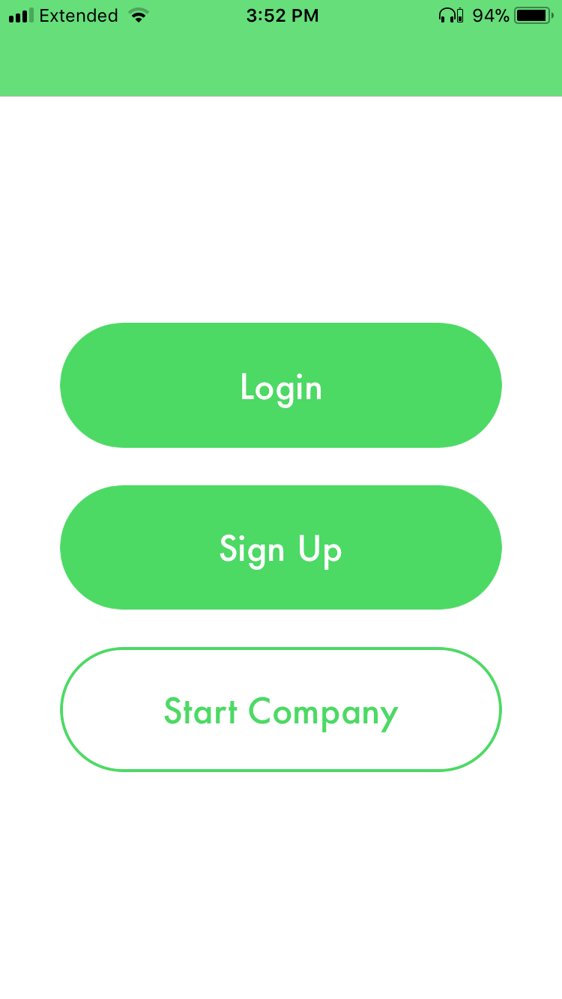
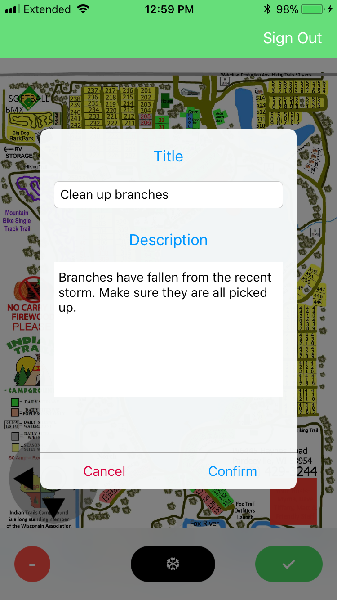
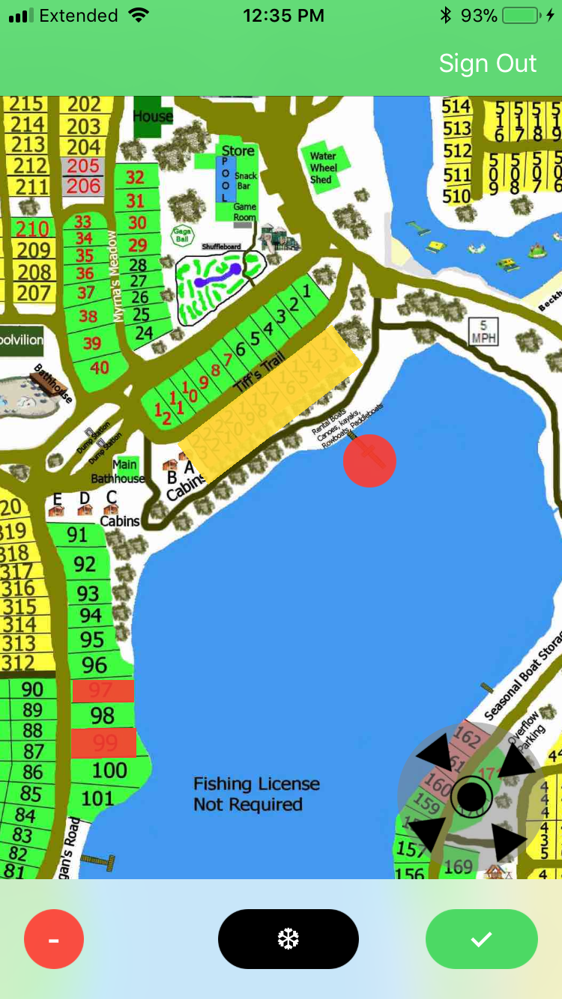
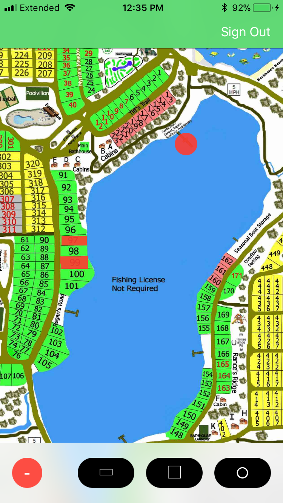
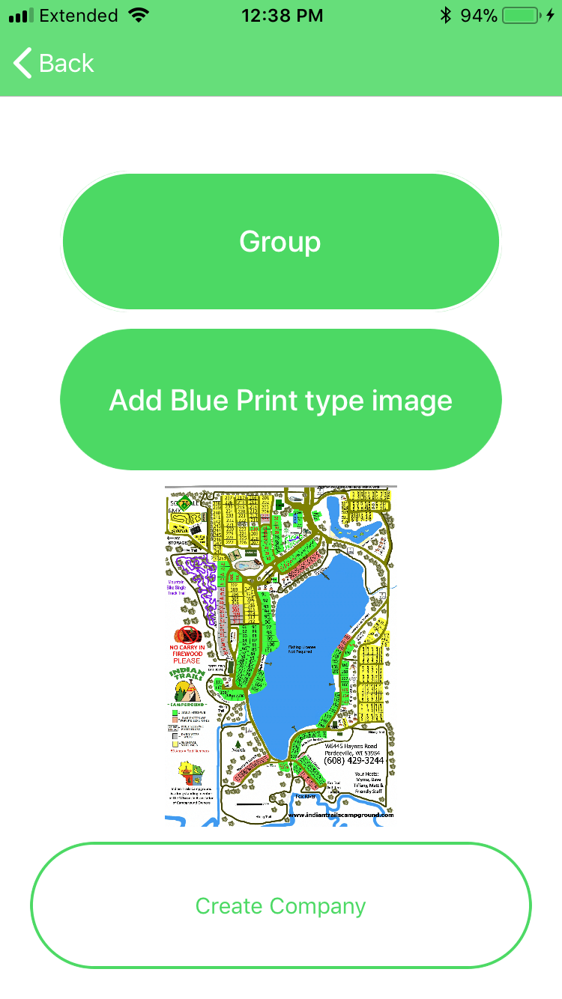

# TaskIt
TaskIt is an iOS application that allows companies, cities, and parks to easily manage and delegate tasks that need to be accomplished. Users of the application can easily see the location of the task and what needs to be done. After the task has been completed the user can complete the task and it will be removed from the map layout. When a task has been accomplished all users of the application will be notified through push notifications. This allows for everyone involved in a group to be notified of the progression of their work. The application also allows for customer feedback from people who are using the company’s facilities or from a citizen who feels that something needs to be fixed in the town they live in.

## Motivation
I created this application because I had worked at a campground for five years and realized that communication was not always clear between employees. I also thought it would be interesting for campers to be able to inform us of problems they had seen. Many people today will refrain from expressing their thoughts in person but feel much more comfortable anonymously and behind a screen. This allows for campers to have the best experience possible.

## Created
The application was developed and launched to the App Store in roughly 3 weeks at the Make School Summer Academy in San Francisco.

## CampgroundManager
In the Spring of 2018 I had created an application similar to this one but much smaller scale. It was specifically for the campground I had worked on and instead of dragging/dropping shapes the overlays for locations on the map were created statically. After completing this project, I was not extremely thrilled with it and knew I could do better and make it usable for more than one specific grounds.

## Screenshots
<h3>Initial Screen</h3>
 

<h3>Task Creation</h3>
 

<h3>Map View</h3>
  

<h3>Group Creation</h3>
 

## How to use
A user must either create a group and receive a group id upon creation of the group or they must know a group id that has already been created by someone else. The user must also create an account and give a valid group id at the time of creating their account. When logging in their group id will be displayed and they can select it to log in under that group. If there is another group that the user wants to belong to they can enter its id during logging in and that group id will also be saved for them.

